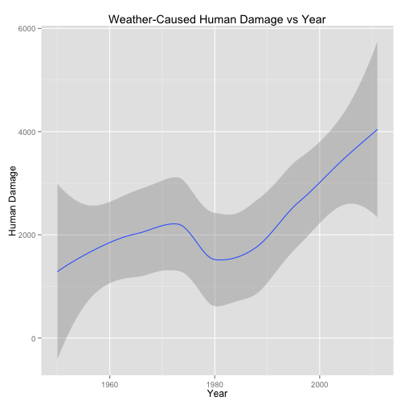
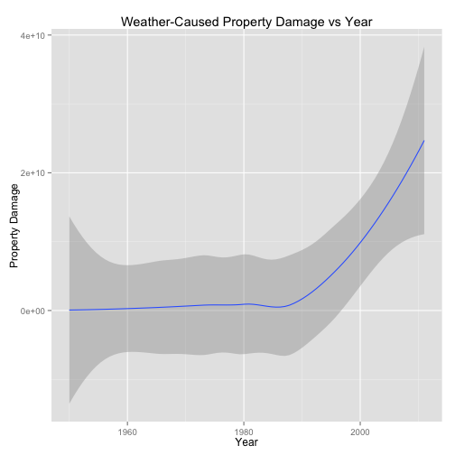
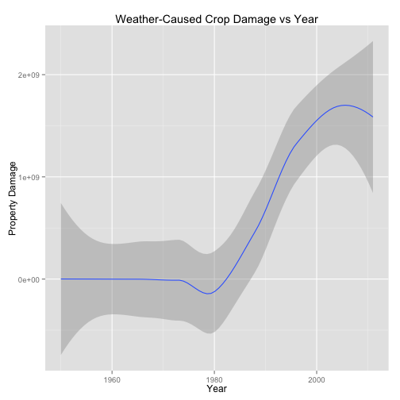

# Severe Weather Events - Health and Economic Consequences

## Synopsis

In this document we examine a dataset from the National Weather Service to 
determine which weather events are most harmful to human health, and which cause
the most economic damage. From the data, we see severe weather events dominate
in terms of both human and economic damage. While the most violent events may be 
difficult to mitigate, there are some opportunities for government and municipal
managers to reduce the consequences of certain types of weather events. Finally,
we examine damage trends over time as an item of interest, and identify why we can't
draw any trend-based conclusions from the current data.

## Data Processing

The data set, available [here](https://d396qusza40orc.cloudfront.net/repdata%2Fdata%2FStormData.csv.bz2), is from the National Weather Service. The following code assumes the data set has been downloaded and has the same file name as the source. This analysis uses a data set downloaded
from the aforementioned URL on August 18, 2015.


```r
stormdata <- read.csv('./repdata-data-StormData.csv.bz2')
```

According to the [data set documentation](https://d396qusza40orc.cloudfront.net/repdata%2Fpeer2_doc%2Fpd01016005curr.pdf), there are 48 permitted weather events. Examining the data set, we see there
are many more events in the data set than the 48 permitted events.


```r
summary(levels(stormdata$EVTYPE))
```

```
##    Length     Class      Mode 
##       985 character character
```

Some of the overlap may be due to differences in case, for example:


```r
levels(stormdata$EVTYPE)[42:44]
```

```
## [1] "blowing snow" "Blowing Snow" "BLOWING SNOW"
```

We can try normalizing the values on case:


```r
stormdata$EVTYPE <- toupper(stormdata$EVTYPE)
```

This changes EVTYPE from a factor to character

We see that there are still more values than the permitted 48:


```r
length(unique(stormdata$EVTYPE))
```

```
## [1] 898
```

A lot of it is just a mess - cleaning this up is well beyond the scope of this assignment.

One simple way to proceed is to just drop everything that is not a permitted event type. We can do this by joining the storm data against the permitted events. First, we'll extract the columns we need for the rest of the analysis, then join the subset against a list of the permitted weather
events.

Note that the R list representation of the weather events was [posted by Deas Richardson to
the Coursera discussion](https://class.coursera.org/repdata-031/forum/thread?thread_id=50#post-259) related to this analysis. I verified the list of events in the 
officialCats definition against the source documentation.


```r
library('dplyr')
sd <- select(stormdata,BGN_DATE, EVTYPE,FATALITIES, INJURIES, PROPDMG, PROPDMGEXP, CROPDMG, CROPDMGEXP)


officialCats <- structure(
  list(
    EventName = structure(
      c(1L, 2L, 3L, 4L, 5L, 6L, 7L, 8L, 9L, 10L, 11L, 12L, 13L, 14L, 15L, 17L, 
        18L, 16L, 19L, 20L, 21L, 22L, 23L, 24L, 25L, 26L, 27L, 28L, 29L, 30L,
        31L, 32L, 33L, 34L, 35L, 36L, 37L, 38L, 39L, 40L, 41L, 42L, 43L, 44L, 
        45L, 46L, 47L, 48L), 
      .Label = c("Astronomical Low Tide", "Avalanche", "Blizzard", 
                 "Coastal Flood", "Cold/Wind Chill", "Debris Flow", 
                 "Dense Fog", "Dense Smoke", "Drought", "Dust Devil", 
                 "Dust Storm", "Excessive Heat", "Extreme Cold/Wind Chill", 
                 "Flash Flood", "Flood", "Freezing Fog", "Frost/Freeze", 
                 "Funnel Cloud", "Hail", "Heat", "Heavy Rain", "Heavy Snow", 
                 "High Surf", "High Wind", "Hurricane (Typhoon)", "Ice Storm", 
                 "Lake-Effect Snow", "Lakeshore Flood", "Lightning", 
                 "Marine Hail", "Marine High Wind", "Marine Strong Wind", 
                 "Marine Thunderstorm Wind", "Rip Current", "Seiche", "Sleet", 
                 "Storm Surge/Tide", "Strong Wind", "Thunderstorm Wind", 
                 "Tornado", "Tropical Depression", "Tropical Storm", "Tsunami", 
                 "Volcanic Ash", "Waterspout", "Wildfire", "Winter Storm", 
                 "Winter Weather"),
      class = "factor"), 
    Designator = structure(
      c(3L, 3L, 3L, 3L, 3L, 1L, 3L, 3L, 3L, 1L, 3L, 3L, 3L, 1L, 1L, 3L, 1L, 3L, 
        1L, 3L, 1L, 3L, 3L, 3L, 3L, 3L, 3L, 3L, 1L, 2L, 2L, 2L, 2L, 3L, 3L, 3L, 
        3L, 3L, 1L, 1L, 3L, 3L, 3L, 3L, 2L, 3L, 3L, 3L), 
      .Label = c("C", "M", "Z"), 
      class = "factor")
    ), 
  .Names = c("EventName", "Designator"), 
  class = "data.frame", 
  row.names = c(NA, -48L)
  )

# Note we convert the permitted event names to uppercase for the join against the
# case normalized base data set.
officialCats$EventName <- toupper(officialCats$EventName)

officialStormData <- inner_join(stormdata, officialCats, c('EVTYPE' = 'EventName'))

psd <- inner_join(sd,officialCats,c('EVTYPE' = 'EventName'))
length(unique(psd$EVTYPE))
```

```
## [1] 46
```

Now we have 46 unique levels.

Next, we need to combine the damage and damage exponent columns to calculate the total damage. First step is to map exp levels (PROPDMGEXP, CROPDMGEXP) to a number. Note for values that don't make sense (+,-,etc.) we use 1 as the value.

The multiplier function will be used to do the mapping.


```r
multiplier <- function(exp) {
  # default to 1 for things that don't make sense, e.g. -,?,+, etc
  m <- 1
  if(exp == "0") {
    m <- 0
  } else if (exp == "2") {
    m <- 2
  } else if (exp == "3") {
    m <- 3
  } else if (exp == "4") {
    m <- 4
  } else if (exp == "5") {
    m <- 5
  } else if (exp == "6") {
    m <- 6
  } else if (exp == "7") {
    m <- 7
  } else if (exp == "8") {
    m <- 8
  } else if (exp == "B") {
    m <- 1000000000
  } else if(exp == "h" || exp == "H") {
    m <- 100
  } else if(exp == "K") {
    m <- 1000 
  } else if(exp == "m" || exp == "M") {
    m <- 1000000
  }
  
  m
  
}
```

Now we can add some multiplier columns:


```r
psd$PDMULT <- sapply(psd$PROPDMGEXP, multiplier)
psd$CDMULT <- sapply(psd$CROPDMGEXP, multiplier)
```

Now we calculate damage totals.

```r
psd$PDTOTAL <- psd$PDMULT * psd$PROPDMG
psd$CDTOTAL <- psd$CDMULT * psd$CROPDMG
```

The data is now is ready for analysis.

## Results

### Events Harmful to Population Health
First, we determine the weather events that are most harmful to population health across the 
United States. For this analysis, I define 'most harmful' as those events with the 
highest total of fatalities and injuries combined. 


```r
by_evtype <- group_by(psd, EVTYPE)
hd <- summarise(by_evtype, HUMANDMG = sum(FATALITIES) + sum(INJURIES))
hd <- arrange(hd, desc(HUMANDMG))
head(hd, n = 15)
```

```
## Source: local data frame [15 x 2]
## 
##               EVTYPE HUMANDMG
## 1            TORNADO    96979
## 2     EXCESSIVE HEAT     8428
## 3              FLOOD     7259
## 4          LIGHTNING     6046
## 5               HEAT     3037
## 6        FLASH FLOOD     2755
## 7          ICE STORM     2064
## 8  THUNDERSTORM WIND     1621
## 9       WINTER STORM     1527
## 10         HIGH WIND     1385
## 11              HAIL     1376
## 12        HEAVY SNOW     1148
## 13          WILDFIRE      986
## 14          BLIZZARD      906
## 15       RIP CURRENT      600
```

As expected, severe weather events like tornados, floods, and lightning dominate the
events that are most harmful to human health.

However, heat related fatalities and injuries are also present; this may represent something
that could be addressed by govenment or municipal managers. Perhaps a combination of awareness
campaigns and resources to aid those most at risk to heat related injuries could reduce the
harm.

### Events With Harmful Economic Consequences
Next, we answer the question of which weather events are most harmful in terms of
economic consequences. We can break this down by property damage and crop damage.

#### Property Damage


```r
pd <- summarise(by_evtype, TOTALPROPDMG = sum(PDTOTAL))
pd <- arrange(pd, desc(TOTALPROPDMG))
head(pd, n = 15)
```

```
## Source: local data frame [15 x 2]
## 
##               EVTYPE TOTALPROPDMG
## 1              FLOOD 144657709807
## 2            TORNADO  56937161054
## 3        FLASH FLOOD  16140812294
## 4               HAIL  15732267427
## 5     TROPICAL STORM   7703890550
## 6       WINTER STORM   6688497250
## 7          HIGH WIND   5270046295
## 8           WILDFIRE   4765114000
## 9   STORM SURGE/TIDE   4641188000
## 10         ICE STORM   3944927810
## 11 THUNDERSTORM WIND   3483121166
## 12           DROUGHT   1046106000
## 13        HEAVY SNOW    932589148
## 14         LIGHTNING    928659369
## 15        HEAVY RAIN    694248090
```

Again, the most extreme weather events dominate those that cause the most econmic damage. 
For policy makers, policies related to avoiding flood damage may be something that can
be done to attempt to minimize damage. As it turns out, we can offer the same observation
for crop data (see below)

#### Crop Damage


```r
cd <- summarise(by_evtype, TOTALCROPDMG = sum(CDTOTAL))
cd <- arrange(cd, desc(TOTALCROPDMG))
head(cd, n = 15)
```

```
## Source: local data frame [15 x 2]
## 
##               EVTYPE TOTALCROPDMG
## 1            DROUGHT  13972566000
## 2              FLOOD   5661968450
## 3          ICE STORM   5022113500
## 4               HAIL   3025537870
## 5        FLASH FLOOD   1421317100
## 6       FROST/FREEZE   1094186000
## 7         HEAVY RAIN    733399800
## 8     TROPICAL STORM    678346000
## 9          HIGH WIND    638571300
## 10    EXCESSIVE HEAT    492402000
## 11           TORNADO    414953110
## 12 THUNDERSTORM WIND    414843050
## 13              HEAT    401461500
## 14          WILDFIRE    295472800
## 15        HEAVY SNOW    134653100
```

#### Trends

It's interesting to look at the data broken down by year to see if we can observe any trends.


```r
library('lubridate')
library('dplyr')
```

```
## 
## Attaching package: 'dplyr'
## 
## The following objects are masked from 'package:lubridate':
## 
##     intersect, setdiff, union
## 
## The following object is masked from 'package:stats':
## 
##     filter
## 
## The following objects are masked from 'package:base':
## 
##     intersect, setdiff, setequal, union
```

```r
library('ggplot2')
psd$year <- year(mdy_hms(as.character(psd$BGN_DATE)))
psd_by_year <- group_by(psd,year)

f <- summarize(psd_by_year,  hdamage=sum(FATALITIES) + sum(INJURIES),
pdamage = sum(PDTOTAL), cdamage=sum(CDTOTAL))


ggplot(f, aes(year,hdamage)) + geom_smooth() + xlab("Year") + ylab("Human Damage") + ggtitle("Weather-Caused Human Damage vs Year")
```

```
## geom_smooth: method="auto" and size of largest group is <1000, so using loess. Use 'method = x' to change the smoothing method.
```

 

```r
ggplot(f, aes(year,pdamage)) + geom_smooth() + xlab("Year") + ylab("Property Damage") + ggtitle("Weather-Caused Property Damage vs Year")
```

```
## geom_smooth: method="auto" and size of largest group is <1000, so using loess. Use 'method = x' to change the smoothing method.
```

 

```r
ggplot(f, aes(year,cdamage)) + geom_smooth() + xlab("Year") + ylab("Property Damage") + ggtitle("Weather-Caused Crop Damage vs Year")
```

```
## geom_smooth: method="auto" and size of largest group is <1000, so using loess. Use 'method = x' to change the smoothing method.
```

 

While in general we see human and economic damage trending up over time, without 
accompanying population data and without adjusting dollar amounts for inflation, we
can't draw any conclusions.
